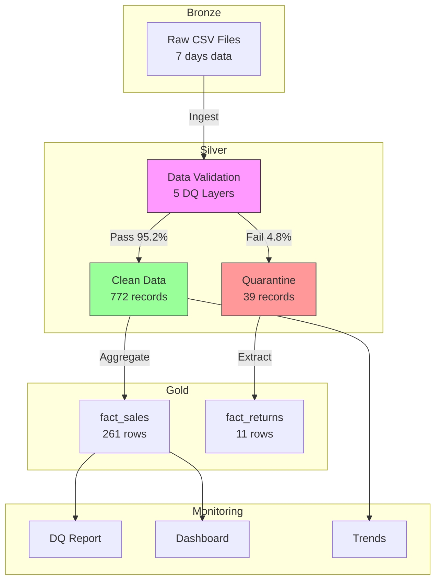

# incremental-sales-pipeline

**🔗 Related Project**: [JP Retail Medallion Pipeline (Project A)](https://github.com/TraderKAI619/project-a-jp-retail-pipeline)  
[](https://github.com/TraderKAI619/incremental-sales-pipeline/actions/workflows/ci.yml)

Idempotent **incremental** sales pipeline with **comprehensive data-quality checks** (pandas + DuckDB).

---

**📚 日本語版 README →** [README_ja.md](./README_ja.md)

---

## ⚡ Quick Start (3 steps)
```bash
# 1) Create & activate env, then install deps
python3 -m venv .venv && source .venv/bin/activate
pip install -r requirements.txt

# 2) One-command run (ingest → silver → gold → DQ → demo)
make run

# 3) Run tests (idempotency + data-quality)
pytest -q tests/
```
---

## Data Quality (5 Layers)
Our pipeline implements comprehensive data quality checks across 5 categories:

| Category              | What We Check                                                 | Implementation                                             |
| --------------------- | ------------------------------------------------------------- | ---------------------------------------------------------- |
| **Duplicates (重複)**   | Natural key uniqueness: `order_date, geo_id, product_id`      | `schemas/*.schema.json`, `scripts/validate_*.py`, `tests/` |
| **Missing (欠損)**      | Required fields non-null/non-empty                            | Schema validation + quarantine logic                       |
| **Outliers (外れ値)**    | Reasonable ranges for `quantity`, `unit_price`, `revenue_jpy` | Schema constraints + business rules                        |
| **Timezone (タイムゾーン)** | `order_date` normalized to JST (YYYYMMDD)                     | `scripts/generate_sales.py`, `scripts/to_silver.py`        |
| **Schema (スキーマ)**     | Column types, PK/FK compliance                                | `schemas/*.schema.json` validation                         |

Quality Metrics (Last run: 2025-10-20)

✅ Pass Rate: 95.2% (772/811 records)

⚠️ Quarantine: 4.8% (39 records) — see reasons

📊 Gold Output: 261 aggregated rows + 11 returns

🚨 Alert threshold: 25% quarantine rate (alert if exceeded)

📊 Latest Reports (CI Artifacts)

dq_report.md – Silver + Gold validation summary

dq_dashboard.txt – Quality dashboard snapshot

quarantine_trends.csv – Historical tracking

fact_returns.csv – Returns analysis
👉 打開最新成功的 workflow run，於 Artifacts 區塊下載：
https://github.com/TraderKAI619/incremental-sales-pipeline/actions/workflows/ci.yml?query=branch%3Amain

## Architecture 

Pipeline Flow

📥 Bronze → Raw CSV ingestion

🔍 Silver → 5-layer DQ validation + quarantine

✅ Gold → Idempotent aggregation (natural key dedup)

📈 Monitor → Quality reports & dashboards

## Known Limitations & Future Work
- **Scope:** Daily ~1k rows; single process; CSV artifacts.
- **Production:** S3 partitioning, Parquet, Glue jobs, Athena, CloudWatch alarms; schema evolution policy.
- **Trade-offs:** Simplicity/reproducibility over scale — see DECISIONS.md

## Performance Snapshot
- **Dataset:** 811 input → 261 gold rows
- **Pipeline:** make run + make check elapsed ~15 sec, Max RSS ~250 MB
- **CI:** tests & validation ~8 sec, artifacts ~5 MB
(Numbers captured via /usr/bin/time -v make run|check | tee reports/perf_make_run.txt.)

## Design Notes & Provenance
- **Decisions (ADR-lite):** see DECISIONS.md
- **Quarantine examples:** see data/silver/quarantine/README.md

## Tooling Transparency
I use AI assistance for boilerplate/doc speed; design, DQ rules, and idempotent strategy are mine.
Focus: reproducibility & observability (tests, dashboard, artifacts).
