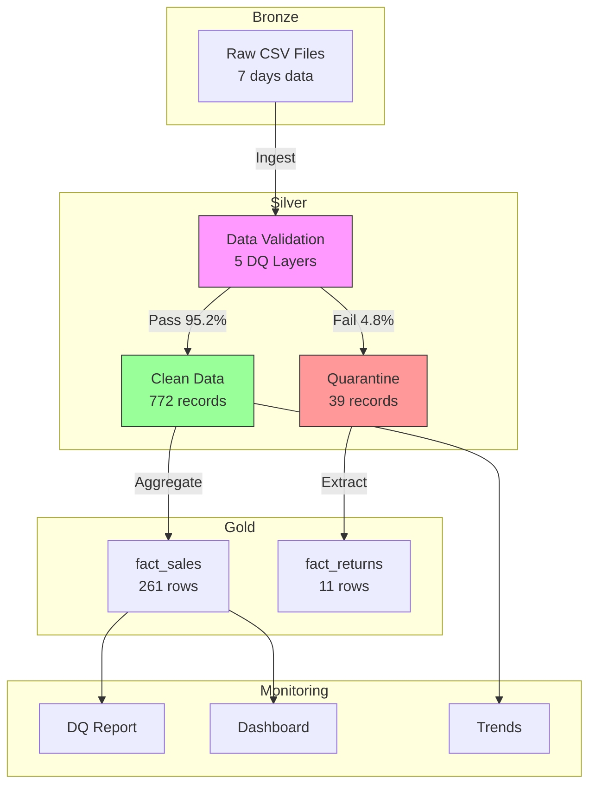

# incremental-sales-pipeline

**🔗 Related Project**: [JP Retail Medallion Pipeline (Project A)](https://github.com/TraderKAI619/project-a-jp-retail-pipeline)
[](https://github.com/TraderKAI619/incremental-sales-pipeline/actions/workflows/ci.yml)
Idempotent **incremental** sales pipeline with **8+ data-quality checks** (pandas + DuckDB).

## ⚡ Quick Start (3 steps)
```bash
# 1) Create & activate env, then install deps
python3 -m venv .venv && source .venv/bin/activate
pip install -r requirements.txt

# 2) One-command run (ingest → silver → gold → DQ → demo)
make run

# 3) Run tests (8 checks incl. idempotency & NK uniqueness)
pytest -q tests/
```

---

**📚 日本語版 README →** [README_ja.md](./README_ja.md)

---

## Data Quality (5 Layers)

Our pipeline implements comprehensive data quality checks across 5 categories:

| Category | What We Check | Implementation |
|----------|--------------|----------------|
| **Duplicates (重複)** | Natural key uniqueness: `order_date, geo_id, product_id` | `schemas/*.schema.json`, `scripts/validate_*.py`, `tests/` |
| **Missing (欠損)** | Required fields non-null/non-empty | Schema validation + quarantine logic |
| **Outliers (外れ値)** | Reasonable ranges for `quantity`, `unit_price`, `revenue_jpy` | Schema constraints + business rules |
| **Timezone (タイムゾーン)** | `order_date` normalized to JST (YYYYMMDD) | `scripts/generate_sales.py`, `scripts/to_silver.py` |
| **Schema (スキーマ)** | Column types, primary/foreign key compliance | `schemas/*.schema.json` validation |

**Quality Metrics:**
- ✅ Pass Rate: 95.2% (772/811 records)
- ⚠️ Quarantine: 4.8% with detailed failure reasons
- 🎯 Threshold: <25% quarantine (currently 13%)

**📊 View Latest Reports:**
All quality reports are automatically generated and available in [GitHub Actions Artifacts](https://github.com/TraderKAI619/incremental-sales-pipeline/actions/workflows/ci.yml?query=branch%3Amain):
- `dq_report.md` - Silver + Gold validation summary
- `dq_dashboard.txt` - Comprehensive quality dashboard (2KB)
- `quarantine_trends.csv` - Historical quality tracking
- `fact_returns.csv` - Returns/adjustments analysis

> 💡 **Tip:** Click on the latest successful workflow run → Scroll to "Artifacts" section → Download reports


