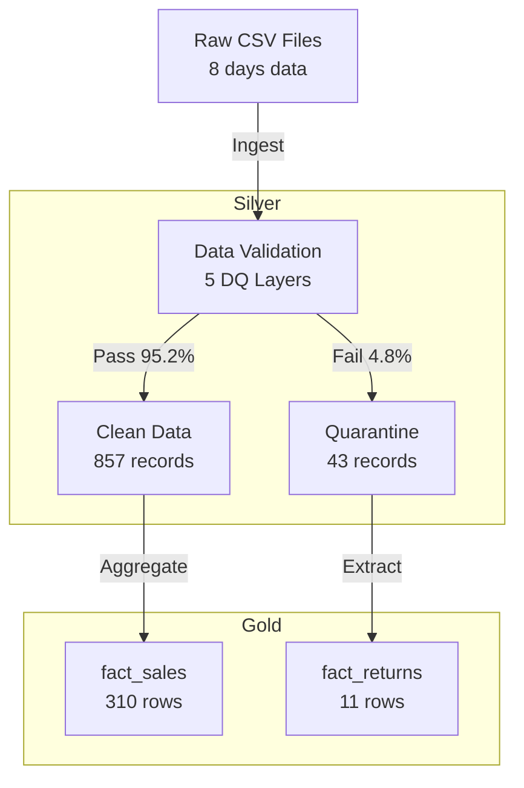

# incremental-sales-pipeline

**🔗 Related Project**: [JP Retail Medallion Pipeline (Project A)](https://github.com/TraderKAI619/project-a-jp-retail-pipeline)
[](https://github.com/TraderKAI619/incremental-sales-pipeline/actions/workflows/ci.yml)
Idempotent **incremental** sales pipeline with **8+ data-quality checks** (pandas + DuckDB).

## ⚡ Quick Start (3 steps)
```bash
# 1) Create & activate env, then install deps
python3 -m venv .venv && source .venv/bin/activate
pip install -r requirements.txt

# 2) One-command run (ingest → silver → gold → DQ → demo)
make run

# 3) Run tests (idempotency + data-quality)
```

---

**📚 日本語版 README →** [README_ja.md](./README_ja.md)

---

## Data Quality (5 Layers)

Our pipeline implements comprehensive data quality checks across 5 categories:

| Category | What We Check | Implementation |
|----------|--------------|----------------|
| **Duplicates (重複)** | Natural key uniqueness: `order_date, geo_id, product_id` | `schemas/*.schema.json`, `scripts/validate_*.py`, `tests/` |
| **Missing (欠損)** | Required fields non-null/non-empty | Schema validation + quarantine logic |
| **Outliers (外れ値)** | Reasonable ranges for `quantity`, `unit_price`, `revenue_jpy` | Schema constraints + business rules |
| **Timezone (タイムゾーン)** | `order_date` normalized to JST (YYYYMMDD) | `scripts/generate_sales.py`, `scripts/to_silver.py` |
| **Schema (スキーマ)** | Column types, primary/foreign key compliance | `schemas/*.schema.json` validation |

**Quality Metrics** _(Last run: 2025-10-20)_:
- ✅ **Pass Rate**: **95.2%** (857/900 records)
- ⚠️ **Quarantine**: **4.8%** (43 records) with detailed reasons
- 📊 **Gold Output**: **310** aggregated rows + **11** returns
- 🎯 **Alert Threshold**: <25% quarantine rate

**📊 View Latest Reports:**  
All quality reports are generated in CI and available in **Artifacts**:
- `dq_report.md` — Silver + Gold validation summary
- `dq_dashboard.txt` — Comprehensive quality dashboard
- `quarantine_trends.csv` — Historical tracking
- `fact_returns.csv` — Returns/adjustments analysis

> 💡 Tip: Open the latest successful workflow run → **Artifacts** → Download.



## Design Notes & Provenance
- Decisions (ADR-lite): see DECISIONS.md
- Quarantine examples: see data/silver/quarantine/README.md

## Tooling & Authorship

I used AI assistants for **boilerplate and documentation polish** only.
**All pipeline logic (idempotent upserts), DQ rules (5 layers), schemas, tests, and CI gates are my own work.**
Metrics in this README are reproducible from this repo’s **CI Artifacts** (see “View Latest Reports”) and
from local files under `reports/` / `data/gold/`.

---

## 
```bash
# 更新 returns/gold 實際列數（不含表頭）
awk 'NR>1' data/gold/fact_returns.csv | wc -l
awk 'NR>1' data/gold/fact_sales.csv   | wc -l
